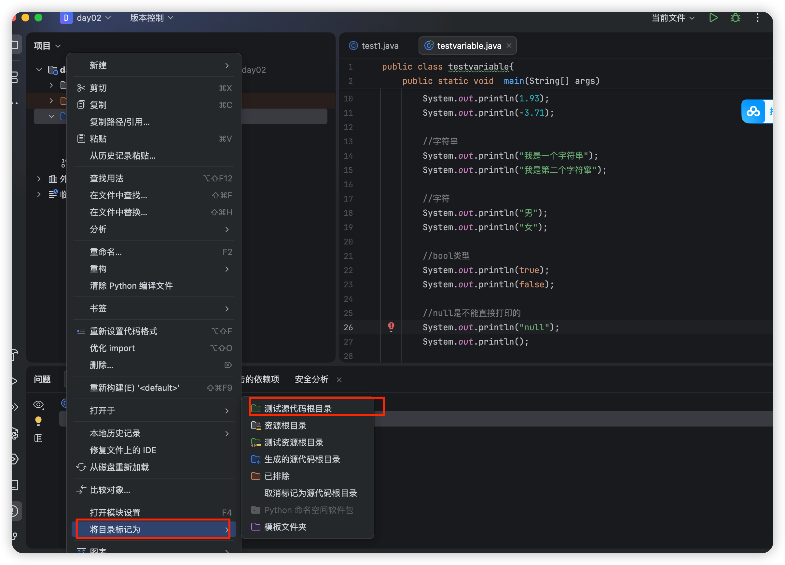

# 1.IDEA某个代码文件运行灰色咋办

找到要运行的代码文件对应的文件夹，右键点击该文件夹，将文件标记为测试源代码文件夹即可



# 2.IDEA快捷键

+ psvm: public static  void main 
+ sout: System.out.println()
+ 100.fori: for (i = 0; i<100; i++)

+ Age.fori ：遍历数组

  ```
  for (int i = 0; i < age.length; i++) {
      
  }
  ```

+ print这个api默认不换行,println这个api默认换行 

+ option command + v自动补齐代码的右边或者右边，比如写个10，按这个快捷键会自动补全 int i = 10; 

+ option command + m 自动抽取方法

+ Option + command + L 自动排版

+ Option + command + T 自动包裹

+ Command D 自动复制该行并复制到下一行

+ Command N 自动补全，生成构造函数（但是要注意，idea的keymap要设置成macos）

+ Alt+回车 自动生成新方法(option+enter)

+ Control + n 自动生成构造函数，get set方法等 

  + 也可以下载ptg插件


# 3.一些学习当中需要注意的

## 3.1 隐式类型转换

* 取值范围小的，和取值范围大的进行运算，小的会先提升为大的，再进行运算。
* byte、short、char三种类型的数据在运算的时候，都会直接先提升为int，然后再进行运算。

## 3.2 强制类型转换

int b = (int) a

## 3.3 三元运算符

int max =  a > b ? a : b ;

## 3.4  


# 4，键盘录入涉及到的方法如下：

​	next（）、nextLine（）、nextInt（）、nextDouble（）。

## 1）next（）、nextLine（）：

可以接受任意数据，但是都会返回一个字符串。

比如：键盘录入abc，那么会把abc看做字符串返回。

​	   键盘录入123，那么会把123看做字符串返回。

### 代码示例：

```java
Scanner sc = new Scanner(System.in);
String s = sc.next();//录入的所有数据都会看做是字符串
System.out.println(s);
```

### 代码示例：

```java
Scanner sc = new Scanner(System.in);
String s = sc.nextLine();//录入的所有数据都会看做是字符串
System.out.println(s);
```

## 2）nextInt（）：

​	只能接受整数。

比如：键盘录入123，那么会把123当做int类型的整数返回。

​	  键盘录入小数或者其他字母，就会报错。

### 代码示例：

```java
Scanner sc = new Scanner(System.in);
int s = sc.nextInt();//只能录入整数
System.out.println(s);
```

## 3）nextDouble（）：

​	能接收整数和小数，但是都会看做小数返回。

​	录入字母会报错。

### 代码示例：

```java
Scanner sc = new Scanner(System.in);
double d = sc.nextDouble();//录入的整数，小数都会看做小数。
						//录入字母会报错
System.out.println(d);
```

## 2，方法底层细节 ：

### 第一个细节：

next（），nextInt（），nextDouble（）在接收数据的时候，会遇到空格，回车，制表符其中一个就会停止接收数据。**然后把其他数据放入缓存区中**

#### 代码示例：

```java
Scanner sc = new Scanner(System.in);
double d = sc.nextDouble();
System.out.println(d);
//键盘录入：1.1 2.2//注意录入的时候1.1和2.2之间加空格隔开。
//此时控制台打印1.1
//表示nextDouble方法在接收数据的时候，遇到空格就停止了，后面的本次不接收。
```

```java
Scanner sc = new Scanner(System.in);
int i = sc.nextInt();
System.out.println(i);
//键盘录入：1 2//注意录入的时候1和2之间加空格隔开。
//此时控制台打印1
//表示nextInt方法在接收数据的时候，遇到空格就停止了，后面的本次不接收。
```

```java
Scanner sc = new Scanner(System.in);
String s = sc.next();
System.out.println(s);
//键盘录入：a b//注意录入的时候a和b之间加空格隔开。
//此时控制台打印a
//表示next方法在接收数据的时候，遇到空格就停止了，后面的本次不接收。
```

### 第二个细节：

next（），nextInt（），nextDouble（）在接收数据的时候，会遇到空格，回车，制表符其中一个就会停止接收数据。但是这些符号 + 后面的数据还在内存中并没有接收。如果后面还有其他键盘录入的方法，会自动将这些数据接收。

代码示例：

```java
Scanner sc = new Scanner(System.in);
String s1 = sc.next();
String s2 = sc.next();
System.out.println(s1);
System.out.println(s2);
//此时值键盘录入一次a b(注意a和b之间用空格隔开)
//那么第一个next();会接收a，a后面是空格，那么就停止，所以打印s1是a
//但是空格+b还在内存中。
//第二个next会去掉前面的空格，只接收b
//所以第二个s2打印出来是b
```

### 第三个细节：

nextLine（）方法是把一整行全部接收完毕。

代码示例：

```java
Scanner sc = new Scanner(System.in);
String s = sc.nextLine();
System.out.println(s);
//键盘录入a b(注意a和b之间用空格隔开)
//那么nextLine不会过滤前面和后面的空格，会把这一整行数据全部接收完毕。
```

## 三、混用引起的后果

上面说的两套键盘录入不能混用，如果混用会有严重的后果。

代码示例：

```java
Scanner sc = new Scanner(System.in);//①
int i = sc.nextInt();//②
String s = sc.nextLine();//③
System.out.println(i);//④
System.out.println(s);//⑤
```

当代码运行到第二行，会让我们键盘录入，此时录入123。

但是实际上我们录的是123+回车。

而nextInt是遇到空格，回车，制表符都会停止。

所以nextInt只能接受123，回车还在内存中没有被接收。

此时就被nextLine接收了。

所以，如果混用就会导致nextLine接收不到数据。

## 四、结论（如何使用）

键盘录入分为两套：

- next（）、nextInt（）、nextDouble（）这三个配套使用。

如果用了这三个其中一个，就不要用nextLine（）。

- nextLine（）单独使用。

如果想要整数，那么先接收，再使用Integer.parseInt进行类型转换。

### 代码示例：

```java
Scanner sc = new Scanner(System.in);
String s = sc.next();//键盘录入123
System.out.println("此时为字符串" + s);//此时123是字符串
int i = sc.nextInt();//键盘录入123
System.out.println("此时为整数：" + i);
```

```java
Scanner sc = new Scanner(System.in);
String s = sc.nextLine();//键盘录入123
System.out.println("此时为字符串" + s);//此时123是字符串
int i = Integer.parseInt(s);//想要整数再进行转换
System.out.println("此时为整数：" + i);
```


# 5.常用API

## String类

这是个常量类，构造函数做完之后他就不会改变了，主要api如下

+ 构造函数 可以传空,字符串常量，字符数组，二进制数组

+ .length():返回这个对象的字符串长度
+ .substring()
  + .substring(start,end) 从strat开始截取到end，左闭右开 
  + .substring(start) 从某个位置开始截取到最后
+ .charAt(index):字符串对应位置数组的字符值
+ .equal() 判断两个字符串是否值相等（如同变量的比较）
+ .toCharArray() 把一个字符串转换为字符数组
+ public int indexOf(String str) 查找参数字符串str在调用方法的字符串中第一次出现的索引，如果不存在，返回-1

## StringBuilder类 插入和反转友好

+ 构造函数可以传空和字符串常量或者String对象
+ append(str):把str加到末尾，但是不产生新的对象，所以很快
+ .reverse() ，反转字符串
+ .toString() 转换成字符串类

##  String Joiner 创建特定格式的字符串友好

+ 构造函数：String Joiner(',')，每个元素之间的间隔是‘，’,如果是3个参数，还规定了String的开始值和结束值

```java
        java.util.StringJoiner s  = new java.util.StringJoiner(",");
        // 三个参数 间隔符号/这个字符串一开始是啥/这个字符串终止符号是啥
        java.util.StringJoiner s1 = new java.util.StringJoiner(",","[","]");
        // 就是一个[]
        s1.add("1").add("2");
        System.out.println(s1);
```

+ Add() 类似于String Builder的 append方法

## ArrayList类，集合类

```java
package Demo;
// 怎样创建一个集合
public class ArrayList {
    // 集合里面有泛形的概念
    public static void main(String[] args) {
        java.util.ArrayList <String> s = new java.util.ArrayList<String>();
        // 集合对象默认不打印地址，打印对象，空对象就是一个[]括号
        System.out.println(s);
    }
}

```

长度可变，但是只能存入引用数据类型

| 方法名                                | 说明                                   |
| ------------------------------------- | -------------------------------------- |
| public boolean add(要添加的元素)      | 将指定的元素追加到此集合的末尾         |
| public boolean remove(要删除的元素)   | 删除指定元素,返回值表示是否删除成功    |
| public E  remove(int   index)         | 删除指定索引处的元素，返回被删除的元素 |
| public E   set(int index,E   element) | 修改指定索引处的元素，返回被修改的元素 |
| public E   get(int   index)           | 返回指定索引处的元素                   |
| public int   size()                   | 返回集合中的元素的个数                 |

